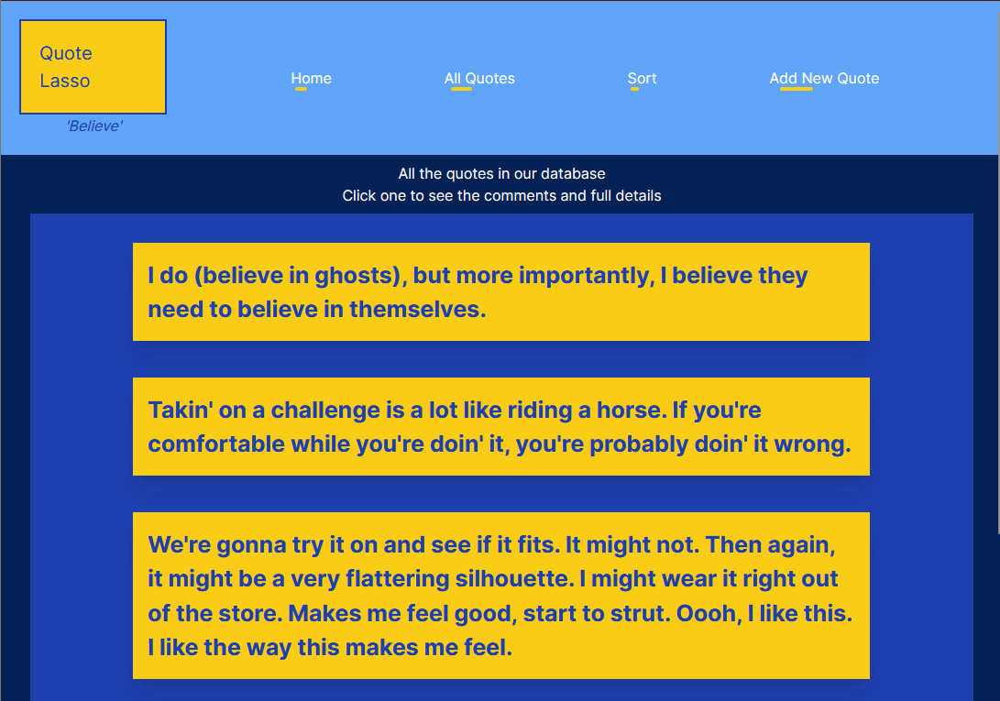
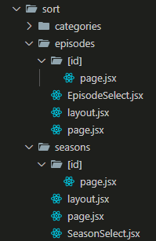
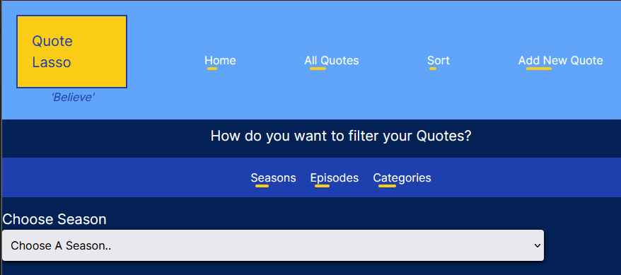

# Week Eight Project

## Project - Build a blog (or similar thing) with comments

**Link to project:** [Quote Lasso](https://quote-lasso.vercel.app/)

This week we added Next.js to our quiver of arrows and were tasked with using the framework to build an interactive website where a user can make posts, others can comment on those individual posts, and also view/sort posts by categories.

In addition, we used Vercel for site and database hosting.

I kept track of my ideas, planning and progress here: [Planning](https://frankjs.notion.site/Day-Thirty-Six-Project-Build-a-Blog-with-Comments-5b2c240021f44cffaf1d30ebbb256325?pvs=4)

### Requirements & Deliverables

- Created with Next.js.
- Design SQL schema.
- Create a 'new post' form.
- Create a 'new comment' form for each post.
- Refresh the `/posts` route and the `/posts:postID` route when making a new post/comment respectively.

**Stretch Goals**

- Posts can be sorted by category.
- Posts or comments can be edited.
- Allow users to 'like' a post.
- Allow users to 'delete' a post/comment.

### User Stories

- As a user, I want to browse a list of posts, sortable by ascending or descending order.
- As a user, I want to see a list of categories, and click on a category to see a list of posts in that category.
- As a user, I want to be able to leave a comment sharing my thoughts on each post.

## The Outcome!

### Features!

- A user can view all of the quotes stored.
- A user can sort quotes by Season, Episodes, or Category.
- A user can comment on any quote and give a 'thumbs up' or 'thumbs down rating.
- A user can add a new quote to the database.
- The 'new quote' page gives a 'live preview' as they're typing.
- Some subtle fancy animations on the links.
- Styled in Ted Lasso blues and yellows, like his famous "Believe" poster.

### What went well

**Planning**

- **DrawSQL**
  DrawSQL was once again very useful for visualising the database schema.
  

  In addition, I made use of Supabase to construct and test my queries before using them on Vercel.

- **Functionality**

The app works really well for viewing quotes and sorting quotes by category. Given the time constraint, I was happy with including these, and also the ability to add new quotes and comments.

I'm pleased with the dynamic routing, and how the <Links> are setup on various pages to allow you to navigate sensibly.

Parameters are passed around nicely such that things like appending the 'Episode Title' to the display works.

Some of the nicer parts of the app are on the "Add Quote" form:

- A 'live preview' of what you're entering.
- The 'episode' you are able to select depends on the 'season' you choose.

**User Interface and Design**

I enjoyed using Tailwind to very quickly get layouts and colour themes going. This blended well with using some classes and selectors in regular CSS to tie the sites theme together.

I followed some Kevin Powell tips on using the `::after` selector with transitions to get the animations working on the <Links> in the header, footer and sort page.

### Sticky points and Difficulties

**Vercel Database**

The main speed hump this week was setting up the database. I found the setup and user experience of Supabase to be way, way nicer. It's integrated SQL editor was more of a pleasure, and made the setup process smoother.

With this in mind, what I ended up doing was using Supabase to 'test build' my tables and queries, then imported (copy/pasted) those into Vercels editor.

**Seeing the correct Episodes when adding a Quote**

I ran an idea past our course tutor, Tim which I wanted to implement on my 'Add New Quote' form, but was struggling with due to separation of client and server components.

- A user should only be able to see the episodes from the season they have selected.

Tim talked me through the idea:

- Pass ALL of the episodes into your form component.
- Separate them out into different variables with state _(an episodesOne array, episodesTwo array, episodesThree array)_.
- Conditionally render the dropdown depending on which Season the user has selected.

Once I had this framework, It was a lot easier to chip away at the idea and get it working.

There were a few bugs to iron out due to how useEffect works, with duplicates appearing within the list, but eventually all ran smooth!

**Sorting**

Thanks to last weeks experience I already had the logic in mind for how I would get the sorting working.

The most time-consuming hurdle to overcome was figuring out how it should be separated.

I achieved this by:

- Having a main `/sort` route
- Having sub routes for `/categories`, `/episodes` and `/seasons`
- Those subroutes are always displayed on the `/sort` route thanks to using `layout.js`.
  
- Each of those sub routes has its own 'select' component to handle the dropdown, a blank page, a layout, and a crucial dynamic [id] route which displays the results.
- Once I had one working well, it was a simple matter of duplicating the code to the others.

Seeing as I have duplicationg, there's probably some kind of fancy streamlined method I could use, but again, time didn't allow and this way works!

### Future Additions

I had many features I wanted to implement, and fancy styling tweaks I wanted to play with (framer motion!!) but time didn't allow.

I also wanted to enhance the home page with a 'carousel' component. This proved too much of a stretch for this week, but I think would look cool and elegant on the home page.

In the future I'd like to add:

- Use the 'thumbs up'/'thumbs down' comment rating on the Main Quote Display to show a total of each. IE `30 Likes` and `4 Dislikes`.
- Deleting comments.
- Updating comments.
- Updating posts.
- Framer motion.
- Metadata.
- Images for richer pages.
- Accessibility enhancements.
- Sort comments by ascending/descending.

### Resources

DrawSQL - [My DrawSQL](https://drawsql.app/teams/personal-1367/diagrams/08-week-eight-project)

Icons - [Thumbs up](https://www.flaticon.com/free-icon/thumb-up_9554962), [Thumbs down](https://www.flaticon.com/free-icon/thumb-down_9554965)

Carousel help - [Future goal!](https://robkendal.co.uk/blog/how-to-build-a-multi-image-carousel-in-react-and-tailwind/) [Another resource.](https://www.kindacode.com/article/tailwind-css-create-an-image-carousel-slideshow/)

IMDB Episode list and some quotes - [IMDB](https://www.imdb.com/title/tt10986410/episodes/?season=1)

Some more quotes - [TV Fanatic](https://www.tvfanatic.com/quotes/shows/ted-lasso/episodes/trent-crimm-the-independent/)
